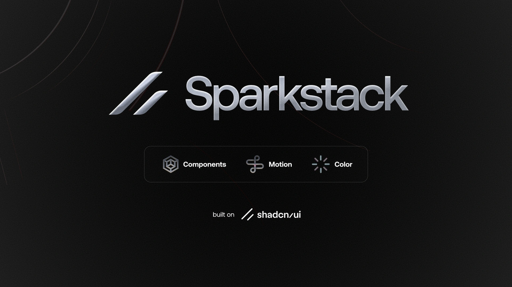

> [!NOTE]
>
> # Sparkstack
>
> ``
> Accessible and customizable components that you can copy and paste into your apps. Free. Open Source. **Use this to build your own component library**. Built on top of shadcn/ui.
> ``
>
> For the most part this repo is maintained by shadcn/ui. I fetch the upstream to keep up to date but extend upon on it when I must. I've consistently found myself pulling shadcn/ui components into projects and spending more time than I'd like in the setup, and customizations. These are some of my baseline adjustments I pull when I need to get something up running quickly. Feel free to use open source.
>
> Bryan Funk

> [!IMPORTANT]
>
> ### :mortar_board: Goals and status
>
> ## Take time back having a prefigured and customized to my liking version of shadcn/ui components
>
> - [x] MVP
>
> - Satisfy the requirements and needs of quickly being able to use an altered shadcn/ui library customized to my liking.
>
> - [ ] Consider a larger release at a later date
>
> ## Up-to-date by upstream
> - [x] Keep shadcn/ui components up to date

> [!TIP]
>
> ### Build & Develop
>
> Visit https://sparkstack.prodkt.cloud to view the documentation.
>
>

> ### * If you've been given access to the Prodkt Docker Hub *
> Local SSH: ssh://git@localhost:2222/main/sparkstack.git
>
> Local HTTP clone URL: http://localhost:8080/main/sparkstack.git
>
